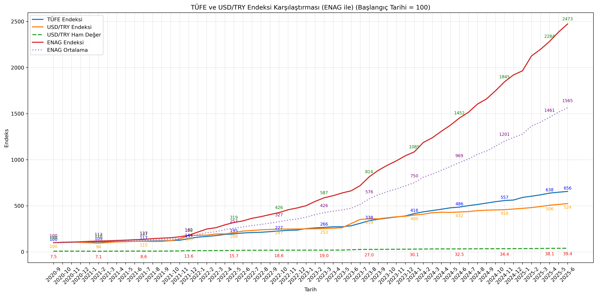
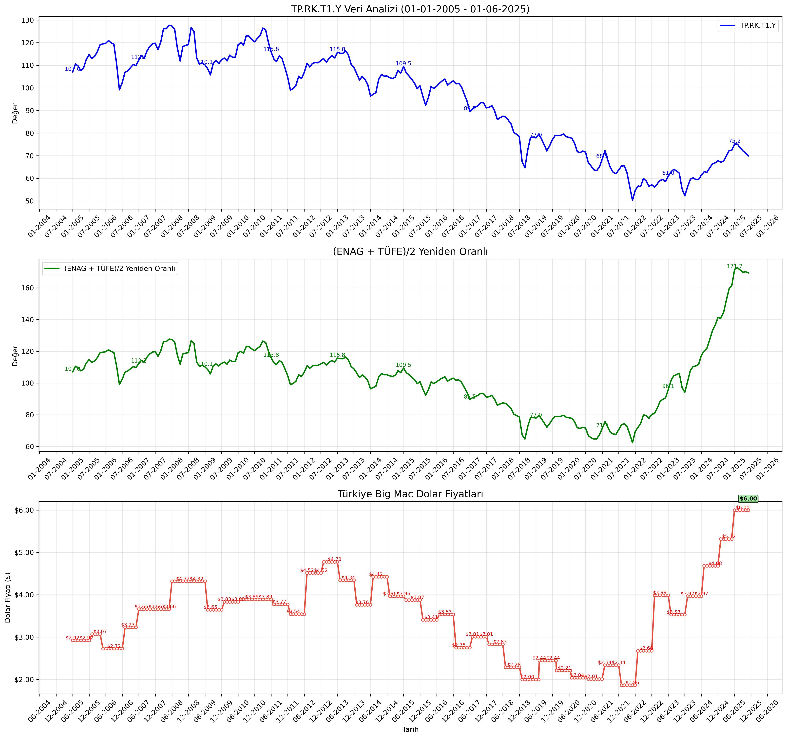
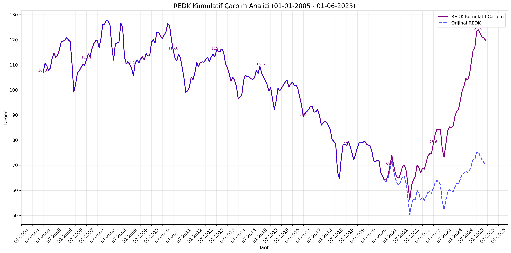
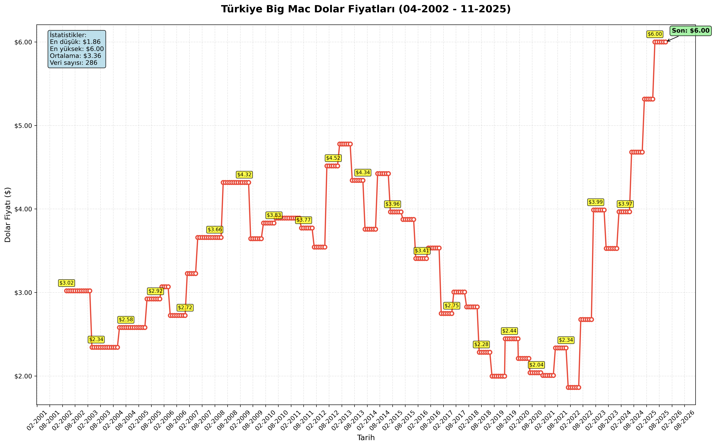
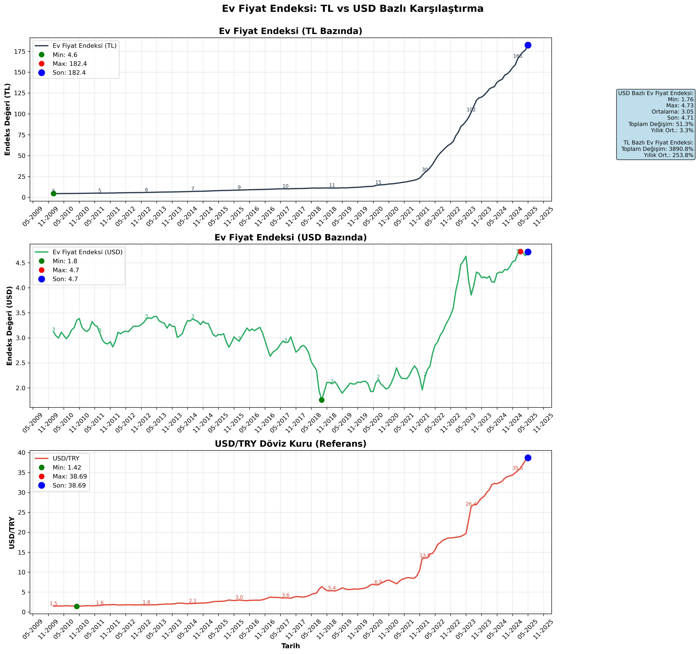
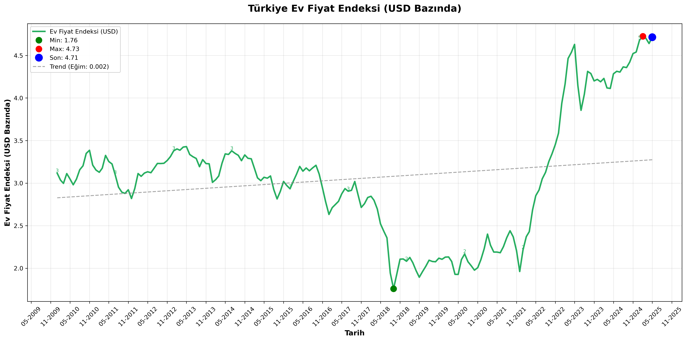

# Türkiye Ekonomik Veri Analiz Araçları

Bu proje, Türkiye'nin ekonomik göstergelerini analiz etmek için bir dizi Python aracı içerir. TÜFE (Tüketici Fiyat Endeksi), USD/TRY döviz kuru, ENAG (Enflasyon Araştırma Grubu) verileri ve REDK (Reel Efektif Döviz Kuru) gibi çeşitli ekonomik göstergeleri analiz etmek ve görselleştirmek için kullanılabilir.



## Oluşturulan Grafik Dosyaları

Scriptler çalıştırıldığında aşağıdaki PNG dosyaları oluşturulur:

### 1. REDK Üç Panel Analizi


**Dosya**: `REDK_Basit_Carpim_[başlangıç]_[bitiş].png`

Bu grafik üç alt panel içerir:
- **Üst Panel**: Orijinal TP.RK.T1.Y (REDK) değerleri
- **Orta Panel**: (ENAG + TÜFE)/2 yeniden oranlanmış değerler
- **Alt Panel**: Türkiye Big Mac dolar fiyatları (6 aylık veri aylık hale genişletilmiş)

### 2. REDK Kümülatif Karşılaştırma


**Dosya**: `REDK_Kumulatif_Carpim_[başlangıç]_[bitiş].png`

Bu grafik iki çizgiyi karşılaştırır:
- **Mor Çizgi**: REDK kümülatif çarpım sonuçları (ENAG-TÜFE ayarlamalı)
- **Mavi Çizgi**: Orijinal REDK değerleri (kesikli çizgi, şeffaf)

### 3. Big Mac Standalone Analizi


**Dosya**: `Big_Mac_Dolar_Fiyatlari_[başlangıç]_[bitiş].png`

Bu grafik şunları gösterir:
- Türkiye Big Mac dolar fiyatlarının zaman serisi analizi
- 6 aylık orijinal veri aylık hale genişletilmiş
- İstatistik kutusu (min, max, ortalama fiyatlar)
- Son fiyat vurgulanmış
- Detaylı fiyat etiketleri

### 4. Ev Fiyat Endeksi TL vs USD Karşılaştırma


**Dosya**: `EvFiyat_TL_USD_Karsilastirma_[başlangıç]_[bitiş].png`

Bu grafik üç alt panel içerir:
- **Üst Panel**: TL bazında ev fiyat endeksi (TP.BIRIMFIYAT.TR)
- **Orta Panel**: USD bazında ev fiyat endeksi (TL endeksi / USD_TRY)
- **Alt Panel**: USD/TRY döviz kuru (referans)
- Min/Max/Son değerler vurgulanmış
- Kapsamlı istatistik kutusu
- 6 aylık X-ekseni formatı

### 5. Ev Fiyat Endeksi USD Analizi


**Dosya**: `EvFiyat_USD_Endeksi_[başlangıç]_[bitiş].png`

Bu grafik şunları gösterir:
- USD bazında ev fiyat endeksinin tek panel analizi
- Trend çizgisi ile eğilim analizi
- Min/Max/Son değerler vurgulanmış
- Detaylı istatistik kutusu (ortalama, medyan, standart sapma)
- Toplam ve yıllık değişim oranları

## Gereksinimler

- Python 3.6+
- pandas
- matplotlib
- numpy
- evds (TCMB EVDS API'si için)

```bash
pip install pandas matplotlib numpy evds
```

## Modüller

### enf.py

TÜFE ve USD/TRY döviz kuru karşılaştırması yapar.

```bash
python enf.py [--start_date DD-MM-YYYY] [--end_date DD-MM-YYYY] [--enag] [--verbose] [--normalize] [--save]
```

Parametreler:
- `--start_date`: Başlangıç tarihi (varsayılan: 01-09-2020)
- `--end_date`: Bitiş tarihi (varsayılan: mevcut tarih)
- `--enag`: ENAG verilerini dahil et
- `--verbose`: Detaylı çıktı göster
- `--normalize`: Verileri normalize et
- `--save`: Grafiği PNG dosyası olarak kaydet

### enag.py

ENAG (Enflasyon Araştırma Grubu) verilerini işlemek için yardımcı modül.

### redk.py

TP.RK.T1.Y (Reel Efektif Döviz Kuru) verisini analiz eder, ENAG-TÜFE değerleri ile kümülatif çarpımını hesaplar ve isteğe bağlı olarak Big Mac Endeksi grafiğini de gösterir. Gelişmiş parametre seçenekleri ile farklı analiz türleri yapılabilir.

```bash
python redk.py [--start_date DD-MM-YYYY] [--end_date DD-MM-YYYY] [--verbose] [--save] [--save_name FILENAME] [--normalize] [--average_enag_tufe] [--enag_only] [--tufe_only] [--add_big_mac] [--same_scale]
```

#### Temel Parametreler:
- `--start_date`, `-s`: Başlangıç tarihi (varsayılan: 01-01-2005)
- `--end_date`, `-e`: Bitiş tarihi (varsayılan: 01-06-2025)
- `--verbose`, `-v`: Detaylı çıktı gösterir
- `--save`: Grafiği PNG dosyası olarak kaydeder
- `--save_name`: Özel dosya adı belirtir
- `--normalize`: Verileri normalize eder

#### Analiz Türü Parametreleri:
- `--average_enag_tufe`: (ENAG + TÜFE)/2 ortalamasını kullanır
- `--enag_only`: Sadece ENAG verilerini kullanır
- `--tufe_only`: Sadece TÜFE verilerini kullanır

#### Görselleştirme Parametreleri:
- `--add_big_mac`: Big Mac Endeksi grafiğini üçüncü panel olarak ekler
- `--same_scale`: Kümülatif karşılaştırma modu (REDK vs hesaplanan değerler)

#### Parametre Kısıtlamaları:
- `--average_enag_tufe` ve `--enag_only` aynı anda kullanılamaz
- `--same_scale` ve `--add_big_mac` aynı anda kullanılamaz

#### Çıktı Modları:

**1. Standart Mod (varsayılan)**:
İki alt grafik içeren görselleştirme:
- **REDK Analizi**: Orijinal TP.RK.T1.Y verileri
- **Hesaplanan Analizi**: Seçilen parametreye göre ENAG/TÜFE analizi

**2. Big Mac Modu (`--add_big_mac`)**:
Üç alt grafik içeren görselleştirme:
- **REDK Analizi**: Orijinal TP.RK.T1.Y verileri
- **Hesaplanan Analizi**: Seçilen parametreye göre ENAG/TÜFE analizi
- **Big Mac Analizi**: Türkiye Big Mac dolar fiyatları

**3. Kümülatif Karşılaştırma Modu (`--same_scale`)**:
İki çizgili karşılaştırma grafiği:
- **Mor Çizgi**: REDK kümülatif çarpım sonuçları
- **Mavi Çizgi**: Orijinal REDK değerleri

#### Grafik Özellikleri:
- Tüm grafikler 6 aylık X-ekseni etiketleme (MM-YYYY formatında)
- Tutarlı zaman çizelgesi ve profesyonel görünüm
- Automatic layout adjustment (üst üste gelme önleme)
- Synchronized tarih aralıkları

#### Örnek Kullanımlar:

```bash
# Temel ENAG-TÜFE analizi
python redk.py --average_enag_tufe

# Big Mac ile birlikte kapsamlı analiz
python redk.py --average_enag_tufe --add_big_mac --save

# Sadece ENAG verisi ile analiz
python redk.py --enag_only --verbose

# Kümülatif karşılaştırma modu
python redk.py --same_scale --save

# Özel tarih aralığı ve dosya adı
python redk.py --start_date 01-01-2020 --end_date 01-01-2025 --save_name "redk_2020_2025.png"
```

### big_mac_analysis.py

Türkiye Big Mac Endeksi dolar fiyatlarını analiz eder ve görselleştirir. 6 aylık veriyi aylık hale getirerek daha ayrıntılı analiz sağlar.

```bash
python big_mac_analysis.py [--file FILENAME] [--start_date DD-MM-YYYY] [--end_date DD-MM-YYYY] [--save] [--no-values] [--analysis-only] [--no-expand]
```

Parametreler:
- `--file`: CSV dosya adı (varsayılan: big-mac-full-index.csv)
- `--start_date`: Başlangıç tarihi (DD-MM-YYYY formatında)
- `--end_date`: Bitiş tarihi (DD-MM-YYYY formatında)
- `--save`: Grafiği PNG dosyası olarak kaydeder
- `--no-values`: Grafik üzerinde değerleri göstermez
- `--analysis-only`: Sadece analiz yapar, grafik çizmez
- `--no-expand`: 6 aylık veriyi aylık hale getirmez

**Özellikler**:
- 6 aylık Big Mac verilerini aylık hale genişletir (her veriyi bir sonraki veri noktasına kadar tekrarlar)
- Tarih aralığı filtreleme
- Detaylı fiyat analizi ve yıllık değişim hesaplaması
- Dinamik grafik etiketleme (veri yoğunluğuna göre)

### ev_fiyat_usd_analysis.py

TCMB EVDS API'sinden TP.BIRIMFIYAT.TR (TL bazında ev fiyat endeksi) ve USD/TRY kuru verilerini çekip USD bazında ev fiyat endeksi hesaplar ve analiz eder.

```bash
python ev_fiyat_usd_analysis.py [--start_date DD-MM-YYYY] [--end_date DD-MM-YYYY] [--save] [--save_name FILENAME] [--comparison] [--usd_only] [--verbose] [--api_key API_KEY]
```

Parametreler:
- `--start_date`, `-s`: Başlangıç tarihi (DD-MM-YYYY formatında, varsayılan: 01-01-2010)
- `--end_date`, `-e`: Bitiş tarihi (DD-MM-YYYY formatında, varsayılan: bugün)
- `--save`: Grafiği PNG dosyası olarak kaydeder
- `--save_name`: Özel dosya adı (PNG uzantısı ile)
- `--comparison`: TL ve USD karşılaştırmalı grafik (3 panel, varsayılan)
- `--usd_only`: Sadece USD bazında tek grafik
- `--verbose`, `-v`: Detaylı çıktı gösterir
- `--api_key`: TCMB EVDS API anahtarı

**Özellikler**:
- **Hesaplama**: Ev_Fiyat_USD = TP.BIRIMFIYAT.TR / USD_TRY
- **Karşılaştırmalı Analiz**: TL bazlı vs USD bazlı ev fiyat endeksi
- **Üç Panel Görselleştirme**: TL endeksi, USD endeksi, USD/TRY referans grafiği
- **Tek Panel Seçeneği**: Sadece USD bazlı analiz + trend çizgisi
- Minimum, maksimum ve son değerleri vurgular
- Kapsamlı istatistiksel analiz ve değişim hesaplamaları
- 6 aylık X-ekseni formatında profesyonel görselleştirme

**Örnek Kullanımlar**:

```bash
# Varsayılan karşılaştırmalı analiz (2010'dan bugüne)
python ev_fiyat_usd_analysis.py --save

# Sadece USD bazlı tek panel analiz
python ev_fiyat_usd_analysis.py --usd_only --save --verbose

# Özel tarih aralığı ile detaylı analiz
python ev_fiyat_usd_analysis.py --start_date 01-01-2015 --end_date 01-01-2025 --comparison --save_name "ev_fiyat_2015_2025.png" --verbose
```

### tufe_filter.py

TÜFE verilerini filtrelemek için yardımcı modül. Özellikle Eylül 2020 öncesi veriler için kullanılır.

## Örnek Kullanım

### TÜFE ve USD/TRY Karşılaştırması

```bash
python enf.py --save
```

Bu komut, TÜFE ve USD/TRY verilerini karşılaştırır ve sonuçları grafikle gösterir.

### ENAG Dahil TÜFE ve USD/TRY Karşılaştırması

```bash
python enf.py --enag --save
```

Bu komut, TÜFE, USD/TRY ve ENAG verilerini karşılaştırır ve sonuçları grafikle gösterir.

### REDK ve ENAG-TÜFE/2 Kümülatif Çarpımı

```bash
python redk.py --save
```

Bu komut, REDK verisini çeker ve 09-2020'den itibaren ENAG-TÜFE/2 değerleri ile kümülatif çarpımını hesaplar. Sonuçları grafikle gösterir ve kaydeder.

### Big Mac Analizi

```bash
python big_mac_analysis.py --save
```

Bu komut, Big Mac Endeksi verilerini analiz eder, Türkiye'nin Big Mac dolar fiyatlarının zaman serisi grafiğini çizer ve detaylı istatistiksel analiz yapar.

### Ev Fiyat Endeksi USD Bazlı Analizi

```bash
python ev_fiyat_usd_analysis.py --save --verbose
```

Bu komut, TCMB'den TL bazında ev fiyat endeksi ve USD/TRY kuru verilerini çeker, USD bazında ev fiyat endeksi hesaplar ve TL vs USD karşılaştırmalı analiz yapar.

```bash
python ev_fiyat_usd_analysis.py --usd_only --save
```

Bu komut, sadece USD bazında ev fiyat endeksini tek grafikte trend çizgisi ile gösterir.

```bash
python ev_fiyat_usd_analysis.py --start_date 01-01-2015 --end_date 01-01-2025 --comparison --save --verbose
```

Bu komut, 2015-2025 dönemini analiz eder ve kapsamlı üç panel karşılaştırma yapar.

## Veri Kaynakları

- TÜFE ve REDK verileri: TCMB EVDS API'si
- ENAG verileri: Enflasyon Araştırma Grubu
- USD/TRY verileri: TCMB EVDS API'si
- Big Mac Endeksi: [The Economist Big Mac Index](https://github.com/TheEconomist/big-mac-data)
  - Resmi Big Mac Index veri seti ve metodolojisi
  - MIT lisansı altında açık kaynak
  - Aylık güncellemeler ve tam tarihsel veri

## Dosya Yapısı

```
EconomicalDataTurkey/
├── enf.py                  # Ana analiz scripti (TÜFE ve USD/TRY)
├── enag.py                 # ENAG veri modülü
├── tufe_filter.py          # TÜFE veri filtreleme yardımcıları
├── redk.py                 # Reel Efektif Döviz Kuru analizi
├── enag_subs_tufe_2.py     # ENAG-TÜFE/2 analizi
├── big_mac_analysis.py     # Big Mac Endeksi analizi
├── ev_fiyat_usd_analysis.py # Ev fiyat endeksi USD bazlı analiz
├── big-mac-full-index.csv  # Big Mac Endeksi verileri (sadece Türkiye)
├── Figure_1.png            # Örnek çıktı görseli
├── REDK_Basit_Carpim_[tarih].png      # REDK üç panel analizi
├── REDK_Kumulatif_Carpim_[tarih].png  # REDK kümülatif karşılaştırma
├── Big_Mac_Dolar_Fiyatlari_[tarih].png # Big Mac standalone analizi
├── EvFiyat_TL_USD_Karsilastirma_[tarih].png # Ev fiyat TL vs USD karşılaştırma
├── EvFiyat_USD_Endeksi_[tarih].png        # Ev fiyat USD endeksi analizi
└── README.md               # Bu dosya
```

## Lisans

Bu proje açık kaynaklıdır.
