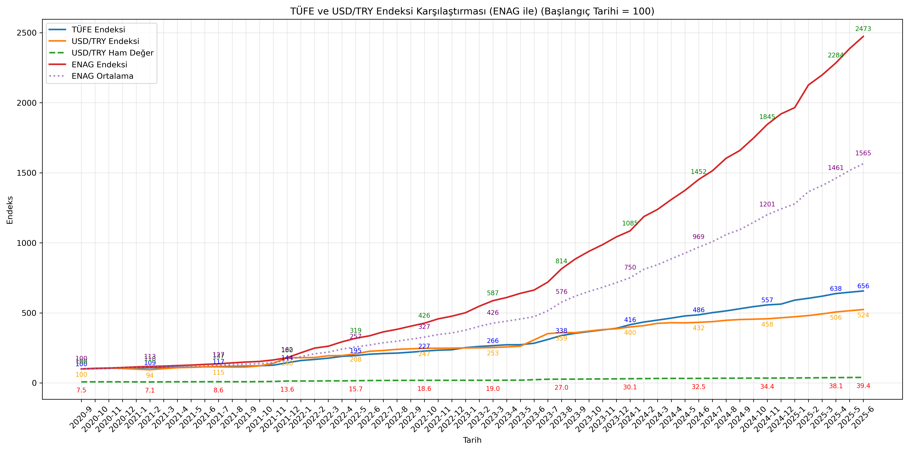
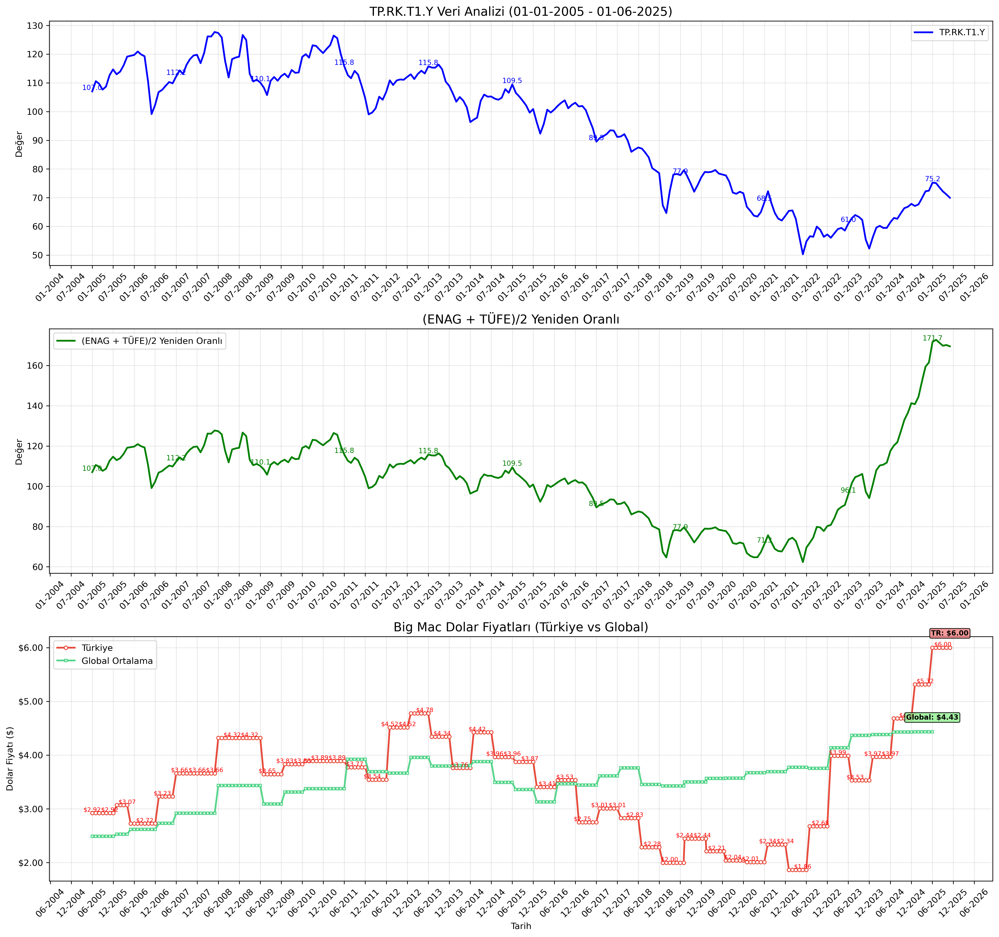
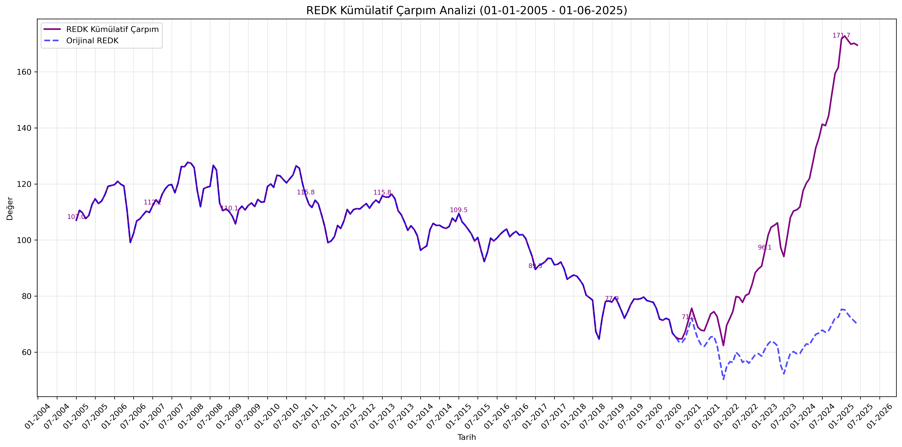
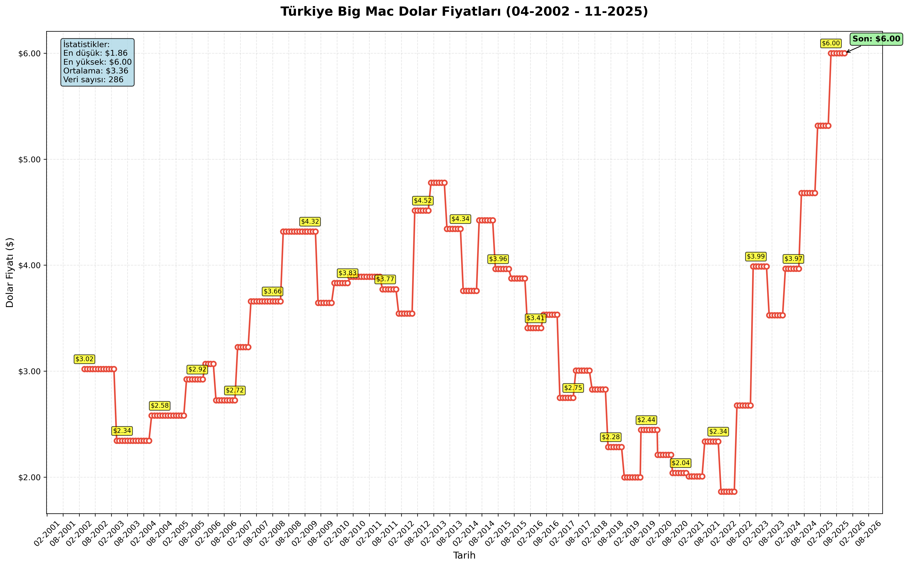
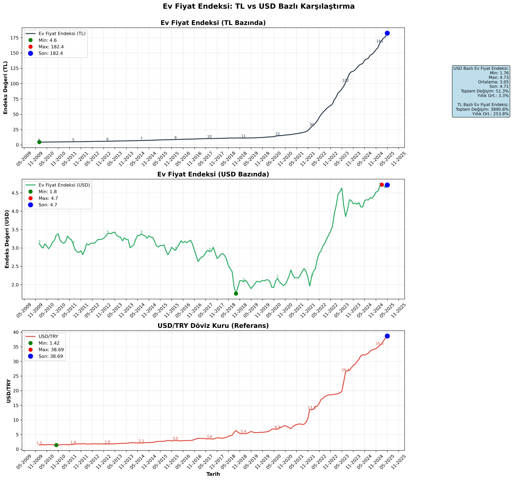
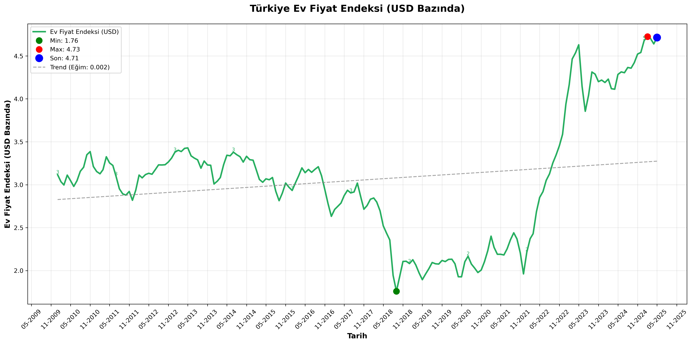

# Türkiye Ekonomik Veri Analiz Araçları

Bu proje, Türkiye'nin ekonomik göstergelerini analiz etmek için bir dizi Python aracı içerir. TÜFE (Tüketici Fiyat Endeksi), USD/TRY döviz kuru, ENAG (Enflasyon Araştırma Grubu) verileri ve REDK (Reel Efektif Döviz Kuru) gibi çeşitli ekonomik göstergeleri analiz etmek ve görselleştirmek için kullanılabilir.



## Oluşturulan Grafik Dosyaları

Scriptler çalıştırıldığında aşağıdaki PNG dosyaları oluşturulur:

### 1. REDK Üç Panel Analizi


**Dosya**: `REDK_Basit_Carpim_[başlangıç]_[bitiş].png`

Bu grafik üç alt panel içerir:
- **Üst Panel**: Orijinal TP.RK.T1.Y (REDK) değerleri
- **Orta Panel**: (ENAG + TÜFE)/2 yeniden oranlanmış değerler
- **Alt Panel**: Big Mac dolar fiyatları karşılaştırması (Türkiye vs Global Ortalama)

### 2. REDK Kümülatif Karşılaştırma


**Dosya**: `REDK_Kumulatif_Carpim_[başlangıç]_[bitiş].png`

Bu grafik iki çizgiyi karşılaştırır:
- **Mor Çizgi**: REDK kümülatif çarpım sonuçları (ENAG-TÜFE ayarlamalı)
- **Mavi Çizgi**: Orijinal REDK değerleri (kesikli çizgi, şeffaf)

### 3. Big Mac Standalone Analizi


**Dosya Çeşitleri**:
- `Big_Mac_Dolar_Fiyatlari_[başlangıç]_[bitiş].png` - Ham fiyatlar
- `Big_Mac_Dolar_Fiyatlari_adjusted_[başlangıç]_[bitiş].png` - GDP-adjusted Türkiye fiyatları
- `Big_Mac_Dolar_Fiyatlari_inflation_adjusted_[başlangıç]_[bitiş].png` - **YENİ**: US CPI enflasyon ayarlı fiyatlar
- `Big_Mac_Dolar_Fiyatlari_global_adjusted_[başlangıç]_[bitiş].png` - GDP-adjusted global ortalama
- `Big_Mac_Dolar_Fiyatlari_adjusted_global_adjusted_[başlangıç]_[bitiş].png` - Her ikisi de GDP-adjusted
- `Big_Mac_Dolar_Fiyatlari_adjusted_inflation_adjusted_[başlangıç]_[bitiş].png` - **YENİ**: GDP + US CPI enflasyon ayarlı
- `Big_Mac_Dolar_Fiyatlari_inflation_adjusted_global_adjusted_[başlangıç]_[bitiş].png` - **YENİ**: US CPI + Global GDP ayarlı

Bu grafik şunları gösterir:
- **Türkiye Big Mac Fiyatları**: Ham veya GDP-adjusted dolar fiyatları
- **Global Ortalama (Opsiyonel)**: Ham veya GDP-adjusted global ortalama fiyatları
- **Karşılaştırmalı Analiz**: Türkiye'nin global ortalamaya göre konumu
- **İstatistik Kutusu**: Hem Türkiye hem global için min, max, ortalama fiyatlar
- **Son Değer Vurguları**: Her iki veri seti için son fiyatlar özel olarak işaretlenmiş
- **Legend**: Hangi fiyat tipinin kullanıldığını gösteren açık etiketleme

### 4. Ev Fiyat Endeksi TL vs USD Karşılaştırma


**Dosya**: `EvFiyat_TL_USD_Karsilastirma_[başlangıç]_[bitiş].png`

Bu grafik üç alt panel içerir:
- **Üst Panel**: TL bazında ev fiyat endeksi (TP.BIRIMFIYAT.TR)
- **Orta Panel**: USD bazında ev fiyat endeksi (TL endeksi / USD_TRY)
- **Alt Panel**: USD/TRY döviz kuru (referans)
- Min/Max/Son değerler vurgulanmış
- Kapsamlı istatistik kutusu
- 6 aylık X-ekseni formatı

### 5. Ev Fiyat Endeksi USD Analizi


**Dosya**: `EvFiyat_USD_Endeksi_[başlangıç]_[bitiş].png`

Bu grafik şunları gösterir:
- USD bazında ev fiyat endeksinin tek panel analizi
- Trend çizgisi ile eğilim analizi
- Min/Max/Son değerler vurgulanmış
- Detaylı istatistik kutusu (ortalama, medyan, standart sapma)
- Toplam ve yıllık değişim oranları

## Gereksinimler

- Python 3.6+
- pandas
- matplotlib
- numpy
- evds (TCMB EVDS API'si için)
- requests (US FRED API'si için) **YENİ**

```bash
pip install pandas matplotlib numpy evds requests
```

### **YENİ**: FRED API Anahtarı
US CPI enflasyon ayarlı analizler için **ücretsiz** FRED API anahtarına ihtiyaç vardır:
1. [https://fred.stlouisfed.org/docs/api/api_key.html](https://fred.stlouisfed.org/docs/api/api_key.html) adresinden ücretsiz hesap oluşturun
2. API anahtarınızı `us_enf.py` dosyasındaki `FRED_API_KEY` değişkenine ekleyin
3. Enflasyon ayarlı analizler artık kullanıma hazır!

## Modüller

### enf.py

TÜFE ve USD/TRY döviz kuru karşılaştırması yapar.

```bash
python enf.py [--start_date DD-MM-YYYY] [--end_date DD-MM-YYYY] [--enag] [--verbose] [--normalize] [--save]
```

Parametreler:
- `--start_date`: Başlangıç tarihi (varsayılan: 01-09-2020)
- `--end_date`: Bitiş tarihi (varsayılan: mevcut tarih)
- `--enag`: ENAG verilerini dahil et
- `--verbose`: Detaylı çıktı göster
- `--normalize`: Verileri normalize et
- `--save`: Grafiği PNG dosyası olarak kaydet

### enag.py

ENAG (Enflasyon Araştırma Grubu) verilerini işlemek için yardımcı modül.

### us_enf.py **YENİ**

US FRED API'sinden Amerikan CPI (Consumer Price Index) verilerini çeker ve enflasyon ayarlı fiyat hesaplamaları için kullanılır.

```bash
python us_enf.py [--series_id SERIES_ID] [--date YYYY-MM-DD]
```

Parametreler:
- `--series_id`: FRED series ID (varsayılan: CPIAUCSL - Consumer Price Index for All Urban Consumers)
- `--date`: Belirli bir tarih için CPI verisi (YYYY-MM-DD formatında). Belirtilmezse en son veri getirilir

**Özellikler**:
- **Akıllı Tarih Eşleştirme**: Tam tarih bulunamadığında en yakın tarihi bulur
- **Otomatik Hata Yönetimi**: API hatalarını yakalar ve bilgilendirici mesajlar verir
- **Programatik Kullanım**: Diğer modüller tarafından CPI verisi almak için kullanılabilir
- **FRED API Entegrasyonu**: St. Louis Federal Reserve'den resmi CPI verileri

#### Örnek Kullanımlar:

```bash
# En son CPI verisini al
python us_enf.py

# Belirli bir tarih için CPI verisi
python us_enf.py --date 2023-01-01

# Farklı bir CPI serisi kullan
python us_enf.py --series_id CPILFESL --date 2023-01-01  # Core CPI (less food and energy)
```

### redk.py

TP.RK.T1.Y (Reel Efektif Döviz Kuru) verisini analiz eder, ENAG-TÜFE değerleri ile kümülatif çarpımını hesaplar ve isteğe bağlı olarak Big Mac Endeksi grafiğini de gösterir. Gelişmiş parametre seçenekleri ile farklı analiz türleri yapılabilir.

```bash
python redk.py [--start_date DD-MM-YYYY] [--end_date DD-MM-YYYY] [--verbose] [--save] [--save_name FILENAME] [--normalize] [--average_enag_tufe] [--enag_only] [--tufe_only] [--add_big_mac] [--same_scale]
```

#### Temel Parametreler:
- `--start_date`, `-s`: Başlangıç tarihi (varsayılan: 01-01-2005)
- `--end_date`, `-e`: Bitiş tarihi (varsayılan: 01-06-2025)
- `--verbose`, `-v`: Detaylı çıktı gösterir
- `--save`: Grafiği PNG dosyası olarak kaydeder
- `--save_name`: Özel dosya adı belirtir
- `--normalize`: Verileri normalize eder

#### Analiz Türü Parametreleri:
- `--average_enag_tufe`: (ENAG + TÜFE)/2 ortalamasını kullanır
- `--enag_only`: Sadece ENAG verilerini kullanır
- `--tufe_only`: Sadece TÜFE verilerini kullanır

#### Görselleştirme Parametreleri:
- `--add_big_mac`: **YENİ**: Big Mac Endeksi grafiğini üçüncü panel olarak ekler (Türkiye vs Global Ortalama karşılaştırması)
- `--same_scale`: Kümülatif karşılaştırma modu (REDK vs hesaplanan değerler)

#### Parametre Kısıtlamaları:
- `--average_enag_tufe` ve `--enag_only` aynı anda kullanılamaz
- `--same_scale` ve `--add_big_mac` aynı anda kullanılamaz

#### Çıktı Modları:

**1. Standart Mod (varsayılan)**:
İki alt grafik içeren görselleştirme:
- **REDK Analizi**: Orijinal TP.RK.T1.Y verileri
- **Hesaplanan Analizi**: Seçilen parametreye göre ENAG/TÜFE analizi

**2. Big Mac Modu (`--add_big_mac`)**:
Üç alt grafik içeren görselleştirme:
- **REDK Analizi**: Orijinal TP.RK.T1.Y verileri
- **Hesaplanan Analizi**: Seçilen parametreye göre ENAG/TÜFE analizi
- **Big Mac Karşılaştırması**: Türkiye vs Global Ortalama Big Mac dolar fiyatları
  - Kırmızı çizgi: Türkiye Big Mac fiyatları
  - Yeşil çizgi: Global ortalama Big Mac fiyatları
  - Son değerler her ikisi için de vurgulanmış
  - Kapsamlı istatistiksel karşılaştırma

**3. Kümülatif Karşılaştırma Modu (`--same_scale`)**:
İki çizgili karşılaştırma grafiği:
- **Mor Çizgi**: REDK kümülatif çarpım sonuçları
- **Mavi Çizgi**: Orijinal REDK değerleri

#### Grafik Özellikleri:
- Tüm grafikler 6 aylık X-ekseni etiketleme (MM-YYYY formatında)
- Tutarlı zaman çizelgesi ve profesyonel görünüm
- Automatic layout adjustment (üst üste gelme önleme)
- Synchronized tarih aralıkları

#### Örnek Kullanımlar:

```bash
# Temel ENAG-TÜFE analizi
python redk.py --average_enag_tufe

# Big Mac ile birlikte kapsamlı analiz (Türkiye vs Global)
python redk.py --average_enag_tufe --add_big_mac --save

# Sadece ENAG verisi ile analiz
python redk.py --enag_only --verbose

# Kümülatif karşılaştırma modu
python redk.py --same_scale --save

# Özel tarih aralığı ve dosya adı
python redk.py --start_date 01-01-2020 --end_date 01-01-2025 --save_name "redk_2020_2025.png"
```

### big_mac_analysis.py

Türkiye Big Mac Endeksi dolar fiyatlarını analiz eder ve görselleştirir. 6 aylık veriyi aylık hale getirerek daha ayrıntılı analiz sağlar. **YENİ**: Global ortalama karşılaştırması ve GDP-adjusted fiyat analizi desteği.

```bash
python big_mac_analysis.py [--file FILENAME] [--start_date DD-MM-YYYY] [--end_date DD-MM-YYYY] [--save] [--no-values] [--analysis-only] [--no-expand] [--add-global-average] [--adjusted-turkey] [--add-adjusted-global] [--enf-adjusted] [--base-date YYYY-MM-DD]
```

#### Temel Parametreler:
- `--file`, `-f`: CSV dosya adı (varsayılan: big-mac-data/output-data/big-mac-tr-index.csv)
- `--start_date`, `-s`: Başlangıç tarihi (DD-MM-YYYY formatında)
- `--end_date`, `-e`: Bitiş tarihi (DD-MM-YYYY formatında)
- `--save`: Grafiği PNG dosyası olarak kaydeder
- `--no-values`: Grafik üzerinde değerleri göstermez
- `--analysis-only`: Sadece analiz yapar, grafik çizmez
- `--no-expand`: 6 aylık veriyi aylık hale getirmez

#### **YENİ** Global ve Adjusted Fiyat Parametreleri:
- `--add-global-average`: **YENİ**: Grafik üzerine global ortalama fiyatları ekler
- `--adjusted-turkey`: **YENİ**: Türkiye için GDP-adjusted fiyatları kullanır (adj_price kolonu)
- `--add-adjusted-global`: **YENİ**: Grafik üzerine global GDP-adjusted ortalama fiyatları ekler
- `--enf-adjusted`: **YENİ**: US CPI verilerini kullanarak enflasyon ayarlı fiyatları hesapla
- `--base-date`: **YENİ**: Enflasyon ayarlaması için baz tarih (YYYY-MM-DD formatında, varsayılan: ilk tarih)

#### Fiyat Türleri:
- **Ham Fiyatlar (dollar_price)**: Yerel Big Mac fiyatlarının direkt USD çevirimi
- **GDP-Adjusted Fiyatlar (adj_price)**: Satın alma gücü paritesine göre ayarlanmış fiyatlar
- **US CPI Enflasyon Ayarlı Fiyatlar**: **YENİ**: US CPI kullanarak belirli bir baz tarihe göre enflasyon ayarlı "reel" fiyatlar

#### Kombinasyon Seçenekleri:

**1. Sadece Türkiye (varsayılan)**:
```bash
python big_mac_analysis.py  # Ham Türkiye fiyatları
python big_mac_analysis.py --adjusted-turkey  # GDP-adjusted Türkiye fiyatları
```

**2. Türkiye + Global Ham Karşılaştırma**:
```bash
python big_mac_analysis.py --add-global-average  # Ham vs Ham
python big_mac_analysis.py --adjusted-turkey --add-global-average  # GDP-adjusted vs Ham
```

**3. Türkiye + Global GDP-Adjusted Karşılaştırma**:
```bash
python big_mac_analysis.py --add-adjusted-global  # Ham vs GDP-adjusted Global
python big_mac_analysis.py --adjusted-turkey --add-adjusted-global  # GDP-adjusted vs GDP-adjusted (en adil karşılaştırma)
```

**4. YENİ: US CPI Enflasyon Ayarlı Analizler**:
```bash
python big_mac_analysis.py --enf-adjusted  # Sadece Türkiye enflasyon ayarlı
python big_mac_analysis.py --enf-adjusted --add-global-average  # Türkiye + Global (ikisi de enflasyon ayarlı)
python big_mac_analysis.py --enf-adjusted --base-date 2020-01-01  # Özel baz tarih ile
python big_mac_analysis.py --adjusted-turkey --enf-adjusted  # GDP + Enflasyon ayarlı kombine
```

#### Görsel Özellikler:
- **Türkiye Verileri**: Kırmızı çizgi, daire işaretçiler
- **Global Veriler**: Yeşil çizgi, kare işaretçiler
- **Dinamik Etiketleme**: Hangi fiyat tipinin kullanıldığını gösteren açık etiketler
- **Çift İstatistik Kutusu**: Hem Türkiye hem global için ayrı istatistikler
- **Son Değer Vurguları**: Her iki veri seti için renk kodlu son fiyat vurguları

#### Dosya Adlandırma:
- `Big_Mac_Dolar_Fiyatlari_YYYYMMDD.png` - Ham Türkiye
- `Big_Mac_Dolar_Fiyatlari_adjusted_YYYYMMDD.png` - GDP-adjusted Türkiye
- `Big_Mac_Dolar_Fiyatlari_inflation_adjusted_YYYYMMDD.png` - **YENİ**: US CPI enflasyon ayarlı Türkiye
- `Big_Mac_Dolar_Fiyatlari_global_adjusted_YYYYMMDD.png` - Ham Türkiye + GDP-adjusted Global
- `Big_Mac_Dolar_Fiyatlari_adjusted_global_adjusted_YYYYMMDD.png` - GDP-adjusted Türkiye + GDP-adjusted Global
- `Big_Mac_Dolar_Fiyatlari_adjusted_inflation_adjusted_YYYYMMDD.png` - **YENİ**: GDP + US CPI enflasyon ayarlı Türkiye
- `Big_Mac_Dolar_Fiyatlari_inflation_adjusted_global_adjusted_YYYYMMDD.png` - **YENİ**: US CPI Türkiye + GDP Global

#### **Özellikler**:
- 6 aylık Big Mac verilerini aylık hale genişletir (her veriyi bir sonraki veri noktasına kadar tekrarlar)
- Tarih aralığı filtreleme
- Detaylı fiyat analizi ve yıllık değişim hesaplaması
- Dinamik grafik etiketleme (veri yoğunluğuna göre)
- **YENİ**: Global ortalama hesaplama ve karşılaştırma
- **YENİ**: GDP-adjusted fiyat analizi (satın alma gücü paritesi)
- **YENİ**: US CPI ile enflasyon ayarlı "reel" fiyat analizi
- **YENİ**: Kombine ayarlama (GDP + Enflasyon)
- **YENİ**: Esnek baz tarih seçimi (enflasyon ayarlaması için)
- **YENİ**: Türkiye vs Global karşılaştırmalı istatistikler
- **YENİ**: Otomatik FRED API entegrasyonu (us_enf.py üzerinden)

#### Örnek Kullanımlar:

```bash
# Temel Türkiye Big Mac analizi
python big_mac_analysis.py --save

# Türkiye vs Global ham fiyat karşılaştırması
python big_mac_analysis.py --add-global-average --save

# GDP-adjusted Türkiye fiyatları
python big_mac_analysis.py --adjusted-turkey --save

# En adil karşılaştırma: GDP-adjusted vs GDP-adjusted
python big_mac_analysis.py --adjusted-turkey --add-adjusted-global --save

# YENİ: US CPI enflasyon ayarlı analiz
python big_mac_analysis.py --enf-adjusted --save

# YENİ: Enflasyon ayarlı + Global karşılaştırma
python big_mac_analysis.py --enf-adjusted --add-global-average --save

# YENİ: Özel baz tarih ile enflasyon ayarlı
python big_mac_analysis.py --enf-adjusted --base-date 2020-01-01 --save

# YENİ: Kombine ayarlama (GDP + Enflasyon)
python big_mac_analysis.py --adjusted-turkey --enf-adjusted --save

# YENİ: En kapsamlı karşılaştırma
python big_mac_analysis.py --adjusted-turkey --enf-adjusted --add-adjusted-global --save

# Özel tarih aralığı ile karşılaştırma
python big_mac_analysis.py --adjusted-turkey --add-adjusted-global --start_date 01-01-2020 --end_date 01-01-2024 --save

# Sadece analiz (grafik yok)
python big_mac_analysis.py --adjusted-turkey --add-adjusted-global --analysis-only
```

### tcmb_fiyat_usd_analysis.py

TCMB EVDS API'sinden TP.BIRIMFIYAT.TR (TL bazında ev fiyat endeksi) ve USD/TRY kuru verilerini çekip USD bazında ev fiyat endeksi hesaplar ve analiz eder.

```bash
python tcmb_fiyat_usd_analysis.py [--start_date DD-MM-YYYY] [--end_date DD-MM-YYYY] [--save] [--save_name FILENAME] [--comparison] [--usd_only] [--verbose] [--api_key API_KEY]
```

Parametreler:
- `--start_date`, `-s`: Başlangıç tarihi (DD-MM-YYYY formatında, varsayılan: 01-01-2010)
- `--end_date`, `-e`: Bitiş tarihi (DD-MM-YYYY formatında, varsayılan: bugün)
- `--save`: Grafiği PNG dosyası olarak kaydeder
- `--save_name`: Özel dosya adı (PNG uzantısı ile)
- `--comparison`: TL ve USD karşılaştırmalı grafik (3 panel, varsayılan)
- `--usd_only`: Sadece USD bazında tek grafik
- `--verbose`, `-v`: Detaylı çıktı gösterir
- `--api_key`: TCMB EVDS API anahtarı

**Özellikler**:
- **Hesaplama**: Ev_Fiyat_USD = TP.BIRIMFIYAT.TR / USD_TRY
- **Karşılaştırmalı Analiz**: TL bazlı vs USD bazlı ev fiyat endeksi
- **Üç Panel Görselleştirme**: TL endeksi, USD endeksi, USD/TRY referans grafiği
- **Tek Panel Seçeneği**: Sadece USD bazlı analiz + trend çizgisi
- Minimum, maksimum ve son değerleri vurgular
- Kapsamlı istatistiksel analiz ve değişim hesaplamaları
- 6 aylık X-ekseni formatında profesyonel görselleştirme

**Örnek Kullanımlar**:

```bash
# Varsayılan karşılaştırmalı analiz (2010'dan bugüne)
python tcmb_fiyat_usd_analysis.py --save

# Sadece USD bazlı tek panel analiz
python tcmb_fiyat_usd_analysis.py --usd_only --save --verbose

# Özel tarih aralığı ile detaylı analiz
python tcmb_fiyat_usd_analysis.py --start_date 01-01-2015 --end_date 01-01-2025 --comparison --save_name "ev_fiyat_2015_2025.png" --verbose
```

### tufe_filter.py

TÜFE verilerini filtrelemek için yardımcı modül. Özellikle Eylül 2020 öncesi veriler için kullanılır.

## Örnek Kullanım

### TÜFE ve USD/TRY Karşılaştırması

```bash
python enf.py --save
```

Bu komut, TÜFE ve USD/TRY verilerini karşılaştırır ve sonuçları grafikle gösterir.

### ENAG Dahil TÜFE ve USD/TRY Karşılaştırması

```bash
python enf.py --enag --save
```

Bu komut, TÜFE, USD/TRY ve ENAG verilerini karşılaştırır ve sonuçları grafikle gösterir.

### REDK ve ENAG-TÜFE/2 Kümülatif Çarpımı

```bash
python redk.py --save
```

Bu komut, REDK verisini çeker ve 09-2020'den itibaren ENAG-TÜFE/2 değerleri ile kümülatif çarpımını hesaplar. Sonuçları grafikle gösterir ve kaydeder.

### **YENİ**: REDK + Big Mac Küresel Karşılaştırma

```bash
python redk.py --add_big_mac --save
```

Bu komut, REDK analizi ile birlikte Türkiye ve Global Big Mac fiyatlarının karşılaştırmasını da gösterir.

### Big Mac Analizi

#### Temel Big Mac Analizi
```bash
python big_mac_analysis.py --save
```

#### **YENİ**: Big Mac Global Karşılaştırma
```bash
# Ham fiyat karşılaştırması
python big_mac_analysis.py --add-global-average --save

# GDP-adjusted karşılaştırma (en adil)
python big_mac_analysis.py --adjusted-turkey --add-adjusted-global --save
```

#### **YENİ**: Detaylı Big Mac Analizleri
```bash
# Sadece GDP-adjusted Türkiye analizi
python big_mac_analysis.py --adjusted-turkey --save

# Ham Türkiye vs GDP-adjusted Global
python big_mac_analysis.py --add-adjusted-global --save

# YENİ: US CPI enflasyon ayarlı Türkiye analizi
python big_mac_analysis.py --enf-adjusted --save

# YENİ: Enflasyon ayarlı + Global ortalama
python big_mac_analysis.py --enf-adjusted --add-global-average --save

# YENİ: Triple ayarlama (GDP + Enflasyon + Global)
python big_mac_analysis.py --adjusted-turkey --enf-adjusted --add-adjusted-global --save

# Özel tarih aralığı ile kapsamlı analiz
python big_mac_analysis.py --adjusted-turkey --add-adjusted-global --start_date 01-01-2020 --end_date 01-01-2024 --save --verbose

# YENİ: Enflasyon ayarlı özel baz tarih ile
python big_mac_analysis.py --enf-adjusted --base-date 2020-01-01 --start_date 01-01-2020 --end_date 01-01-2024 --save
```

### Ev Fiyat Endeksi USD Bazlı Analizi

```bash
python tcmb_fiyat_usd_analysis.py --save --verbose
```

Bu komut, TCMB'den TL bazında ev fiyat endeksi ve USD/TRY kuru verilerini çeker, USD bazında ev fiyat endeksi hesaplar ve TL vs USD karşılaştırmalı analiz yapar.

```bash
python tcmb_fiyat_usd_analysis.py --usd_only --save
```

Bu komut, sadece USD bazında ev fiyat endeksini tek grafikte trend çizgisi ile gösterir.

```bash
python tcmb_fiyat_usd_analysis.py --start_date 01-01-2015 --end_date 01-01-2025 --comparison --save --verbose
```

Bu komut, 2015-2025 dönemini analiz eder ve kapsamlı üç panel karşılaştırma yapar.

## **YENİ ÖZELLIKLER v2.0**

### Big Mac Global Karşılaştırma Sistemi
- **Ham vs Ham**: Direkt fiyat karşılaştırması
- **GDP-Adjusted vs GDP-Adjusted**: Satın alma gücü bazlı adil karşılaştırma
- **Hibrit Kombinasyonlar**: Ham Türkiye vs GDP-adjusted Global veya tersi
- **Otomatik Global Ortalama Hesaplama**: 40+ ülkenin Big Mac fiyatlarından otomatik ortalama

### Enhanced REDK Analysis
- **Big Mac Entegrasyonu**: REDK analizi ile Big Mac küresel karşılaştırması tek grafikte
- **Türkiye vs Global Positioning**: Türkiye'nin küresel Big Mac pazarındaki konumu

### **YENİ**: US CPI Enflasyon Ayarlı Analiz Sistemi
- **Reel Fiyat Hesaplama**: US CPI verileri ile "gerçek" satın alma gücü analizi
- **Esnek Baz Tarih**: Kullanıcı tanımlı baz tarih veya otomatik ilk tarih
- **Otomatik API Entegrasyonu**: FRED API üzerinden güncel CPI verileri
- **Kombine Ayarlama**: GDP + Enflasyon ayarlaması aynı anda
- **Global Uyumluluk**: Hem Türkiye hem global veriler için enflasyon ayarlaması

#### Enflasyon Ayarlaması Nasıl Çalışır?
```
Ayarlı Fiyat = Orijinal Fiyat × (Baz Tarih CPI / Mevcut Tarih CPI)
```

**Örnek**: 2023'te $4.50 olan Big Mac, 2020 baz yılına göre ne kadar?
- 2020 CPI: 258.8
- 2023 CPI: 307.0
- Ayarlı Fiyat: $4.50 × (258.8/307.0) = $3.79

Bu, 2023'teki $4.50'ın 2020 satın alma gücü olarak $3.79'a eşit olduğunu gösterir.

### Gelişmiş Dosya Yönetimi
- **Akıllı Dosya Adlandırma**: Kullanılan parametrelere göre otomatik dosya adlandırma
- **Versiyonlu Çıktılar**: Ham, adjusted, global varyantları için farklı dosya isimleri

## Veri Kaynakları

- TÜFE ve REDK verileri: TCMB EVDS API'si
- ENAG verileri: Enflasyon Araştırma Grubu
- USD/TRY verileri: TCMB EVDS API'si
- **YENİ**: US CPI verileri: [St. Louis Federal Reserve (FRED) API](https://fred.stlouisfed.org/docs/api/fred/)
  - FRED API anahtarı gereklidir (ücretsiz)
  - Consumer Price Index for All Urban Consumers (CPIAUCSL)
  - Aylık CPI verileri (1947'den günümüze)
  - Enflasyon ayarlı fiyat hesaplamaları için kullanılır
- Big Mac Endeksi: [The Economist Big Mac Index](https://github.com/TheEconomist/big-mac-data)
  - Resmi Big Mac Index veri seti ve metodolojisi
  - MIT lisansı altında açık kaynak
  - Aylık güncellemeler ve tam tarihsel veri
  - **YENİ**: 40+ ülke verisi ile global ortalama hesaplama
  - **YENİ**: GDP-adjusted fiyat verisi (satın alma gücü paritesi)

## Dosya Yapısı

```
EconomicalDataTurkey/
├── enf.py                  # Ana analiz scripti (TÜFE ve USD/TRY)
├── enag.py                 # ENAG veri modülü
├── tufe_filter.py          # TÜFE veri filtreleme yardımcıları
├── redk.py                 # Reel Efektif Döviz Kuru analizi
├── enag_subs_tufe_2.py     # ENAG-TÜFE/2 analizi
├── big_mac_analysis.py     # Big Mac Endeksi analizi (YENİ: Global karşılaştırma + Enflasyon ayarlı)
├── us_enf.py               # YENİ: US CPI/Enflasyon verisi (FRED API)
├── tcmb_fiyat_usd_analysis.py # Ev fiyat endeksi USD bazlı analiz
├── big-mac-data/           # Big Mac veri klasörü
│   └── output-data/
│       ├── big-mac-tr-index.csv      # Türkiye Big Mac verileri
│       └── big-mac-full-index.csv    # YENİ: Global Big Mac verileri
├── graphs/                 # Otomatik oluşturulan grafik klasörü
│   ├── REDK_Basit_Carpim_[tarih].png
│   ├── REDK_Kumulatif_Carpim_[tarih].png
│   ├── Big_Mac_Dolar_Fiyatlari_[tarih].png
│   ├── Big_Mac_Dolar_Fiyatlari_adjusted_[tarih].png     # YENİ
│   ├── Big_Mac_Dolar_Fiyatlari_inflation_adjusted_[tarih].png  # YENİ: US CPI enflasyon ayarlı
│   ├── Big_Mac_Dolar_Fiyatlari_global_adjusted_[tarih].png  # YENİ
│   ├── Big_Mac_Dolar_Fiyatlari_adjusted_global_adjusted_[tarih].png  # YENİ
│   ├── Big_Mac_Dolar_Fiyatlari_adjusted_inflation_adjusted_[tarih].png  # YENİ: GDP + US CPI
│   ├── Big_Mac_Dolar_Fiyatlari_inflation_adjusted_global_adjusted_[tarih].png  # YENİ: US CPI + Global GDP
│   ├── EvFiyat_TL_USD_Karsilastirma_[tarih].png
│   └── EvFiyat_USD_Endeksi_[tarih].png
├── Figure_1.png            # Örnek çıktı görseli
└── README.md               # Bu dosya
```

## Lisans

Bu proje açık kaynaklıdır.
